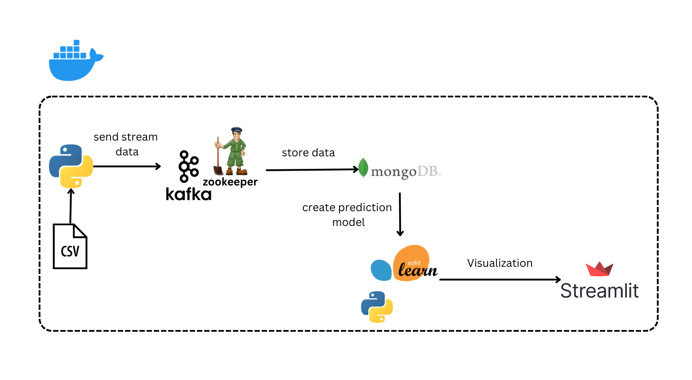
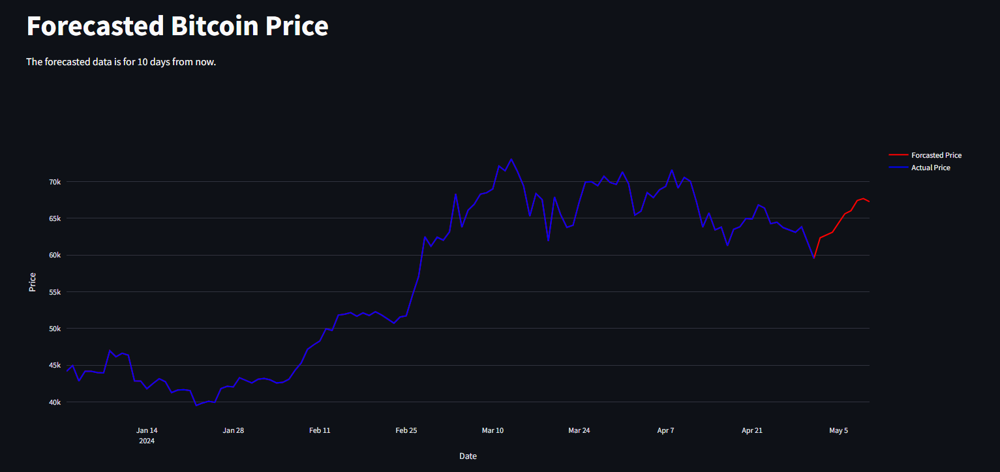

# Background

This project aims to predict Bitcoin prices using a combination of real-time data streaming and machine learning. Apache Kafka is utilized to collect and stream Bitcoin price data into a MongoDB database for efficient storage and retrieval. A Random Forest machine learning model is then applied to the historical data from MongoDB to predict future price trends. The predictions are visualized using Streamlit, providing a user-friendly interface for real-time analysis. This approach integrates modern data engineering techniques with machine learning to offer insights into Bitcoin price movements.

For the machine learning, I used the Random Forest Regressor model combined with the RandomizedSearchCV function to optimize hyperparameters. The best model achieved a prediction accuracy of 96% with a Mean Absolute Error (MAE) of 1162.2, providing a reliable forecast for Bitcoin price trends.

# Flow

# Dataset
https://www.kaggle.com/datasets/kapturovalexander/bitcoin-and-ethereum-prices-from-start-to-2023?select=Bitcoin+USD+%2801-05.2024%29.csv

# App Preview

# How To Run

1. Run all shells on `notebook/bitcoinData.ipynb`
2. Run docker compose using `docker-compose up --build -d`
3. Access streamlit app at `localhost:3501`

# Potential Improvements for the Machine Learning Model

The machine learning model in this project can be improved by exploring more advanced techniques such as Gradient Boosting or deep learning models like LSTM, which are well-suited for time series data. Additionally, feature engineering could enhance the model's performance by incorporating more relevant features like trading volume, market sentiment, or macroeconomic indicators. Cross-validation techniques could be refined, and further hyperparameter tuning can be performed to achieve even better accuracy and lower MAE. Integrating more data sources and increasing the dataset size might also improve the model's robustness and generalization.